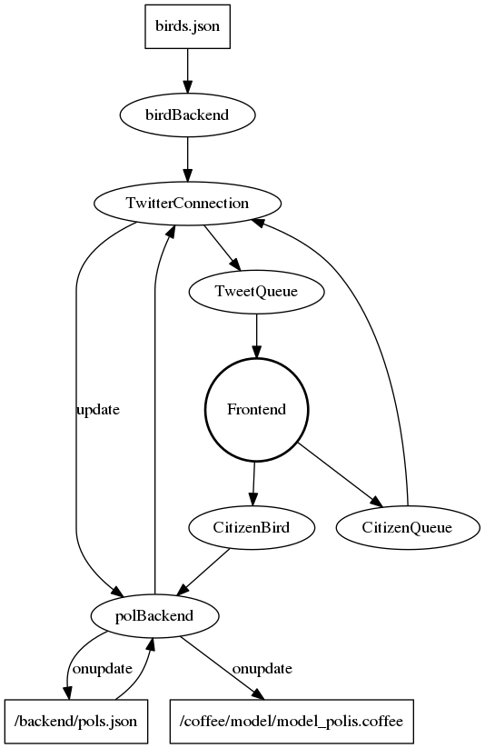

## Data flow

See attached file `dataflow.png`:

## Data formats

### Politicians (`pols.json` and `model_polis.coffee`)

Both files are essentially just JSON objects, with the politician ID being the key and politician entry being the value.
Currently, `backend/pols.json` actually is a list of such entries, but that will change.  # FIXME

Each politician entry has:
- `twittering` (optional): JSON object, contact information on Twitter if existing
    - `twitterId`: integer/string, Twitter-internal ID, e.g. `569166756`
    - `twitterUserName`: string, Twitter-Handle, e.g. `"lisapaus"`
- `self_bird`, `citizen_bird`: string, bird-IDs of the politician-chosen and citizen-chosen birds, respectively, e.g. `"gartenbaumlaeufer"`
- `party`: string, official name of the party, e.g. `"GR\u00dcNE"`
- `name`, `full_name`: string, official name of the politician (without and with titles, respectively), e.g. `"Elisabeth Paus"`  
  FIXME: currently `full_name` does not exist
- `pid`: string, HoT-internal ID of the politician, e.g. `"418"` or `"hot"`
- `cv`: JSON object, description of the politician
  - `en`, `de`: string, human-readable description of the politician, e.g. `"Lisa Paus (* 19. September 1968 in Rheine) ist …"`
- `images`: JSON object, profile photo
  - `pathToImage`, `pathToThumb`: string, filename of the normal and thumb image, e.g. `"t418.jpg"`  
    Note that this is not really a path, but rather relative to `/ext/images/politicians/`
  - `copyright` (optional): string, the holder of the copyright ("Urheber"), e.g. `spdfraktion.de (Susie Knoll / Florian J\u00e4nicke)`
  - `license`: string, describes the license under which we use this image, possible values:
    - `unknown-bundestag`, `custom-linke`, `custom-gruene`, `custom-spd`
    - `public domain`
    - `CC0 1.0`
    - `CC-BY-SA-4.0 int`, `CC-BY-4.0 int`
    - `CC-BY-SA-3.0 de`, `CC-BY-SA-3.0 unported`, `CC-BY-SA-3.0 at`, `CC-BY-SA-3.0- unported`, `CC-BY-3.0 de`, `CC-BY-3.0 unported`, `CC-BY-SA-2.5`, `CC-BY-SA-2.0 de`, `CC-BY-SA-2.0`, `CC-BY-2.0`
    - `GFDL 1.2+`, `GFDL 1.2`
    - `custom: attribution (FAL)`, `custom: attribution`

### Queue "tweets"

Direction: backend → frontend

- `poli`: string, the HoT-internal ID of the politician or `null` if citizen, e.g. `null` or `"649"`
- `content`: string, e.g. `"Wir dürfen uns nicht auseinander dividieren lassen!"`
- `hashtags`: possibly empty array, each element is a string, containing a single hashtag, without the leading hash, e.g. `[]` or `["what", "doomed"]`
    Note that frontend should NOT parse this for `HoT` or something.
- `id`: number, any unique id, assigned by the Backend, e.g. `1`
- `image`: string, valid URL to Twitter profile image, e.g. `"- `https`://pbs.twimg.com/profile_images/573488117560295424/5qsXbC5W.jpeg"`
- `name`: string, e.g. `"Angela Merkel"`
- `partycolor`: string, any valid CSS color as a string, e.g. `"#00cc00"`
- `party` (optional): string, official name of the party (not present if a citizen), e.g. `"GR\u00dcNE"`
- `refresh`: JSON object, only present if the backend detected a valid usage of `#HoT`
    - `politicianId`: string, only present if 'byPoli' is true, HoT-defined ID, e.g. `"hot"` or `"384"`
    - `birdId`: string, the newly assigned bird, e.g. `"amsel"` (always a valid key in birds.json)
- `retweet`: boolean, e.g. `true`
- `sound`: JSON object
    - `citizen`: JSON object, describing the bird chosen by the citizen
        - `natural`: string, valid path to the bird's natural sound, e.g. `"/home/eispin/workspace/House-Of-Tweets/ext/sounds/processed/774316458742583296r-c_n.mp3"`
        - `bid`: string, containing the raw bird ID, and a valid key for `coffee/model/model_birds.coffee`
        - `duration`: integer, length, in milliseconds, of the sounds
    - `poli` (optional): same, but chosen by the politician.
        Only present if author is a politician.
- `time`: string, containing unix timestamp (seconds since 1970-01-01), e.g. `"1453840647"`
- `twitterName`: string, twitter-handle without '@' char, e.g. `"pes04"`

### Queue "userBirdNack"

Direction: backend → frontend

- `twittername`: same as from the `citizenuser` request
- `birdid`: same as from the `citizenuser` request
- `error`: string, contains the id of any error.  Possible values are:
    - `null`: no error occurred
    - `"unknown-user"`: couldn't resolve `twittername` (note that inclusion of the
      initial `@` does not matter, and twitter-handles are case-insensitive)
    - `"unknown-bird"`: couldn't resolve `birdid`

### Queue "citizenbirds"

Direction: frontend → backend

- `politicianid`: string, the HoT-internal politician-ID, e.g. `"195"` or `"notavalidpolitician"`
- `birdid`: string, the (unsanitized) bird name, e.g. `"ara"` or `"notavalidbird"`

### Queue "citizenuser"

Direction: frontend → backend

- `twittername`: string, the (unsanitized) twitter handle of the user,
  may (but does not need to) include the `@` character, e.g. `"HouseOfTweetsSB"`
  or `"@HouseOfTweetsSB"` or `"notavalidtwitterhandle"`
- `birdid`: string, the (unsanitized) bird name, e.g. `"ara"` or `"notavalidbird"`

## Known Threads

- `mq.py` creates a Timer for the batcher and for heartbeats.
  Concurrency between this Timer and the owner of the `TweetBatcher`/`RealQueue` is synchronized
  via a lock inside the `TweetBatcher`/`RealQueue`.
  However, nobody else should access the same connection.
- Each "incoming" RabbitMQ queue has its own thread. Locking: must happen in the called functions,
  namely `TwitterConnection.addCitizen` and `PoliticianBackend.setBird`
- Tweepy: the streaming part of the twitter connection itself spawns at least one thread,
  and we're accessing it concurrently for the REST API.  Locking: `RealTwitterInterface.self.lock`,
  but *not* when the stream needs to be restarted.  So essentially we might crash/UB whenever this
  happens.
- RealTwitterInterface: (re)spawns a thread every few seconds to do the REST poll if necessary.
- Note that `TwitterConnection` creates one `filter` for all politicians
  together, and then one for *each* active citizen. `TwitterConnection`
  also creates threads (`Timer` objects) to remove citizens.
  Locking: giant `TwitterConnection` lock
- the main thread just sets everything up, finishes immediately, and waits on all other threads.
  Locking: Python internal.
